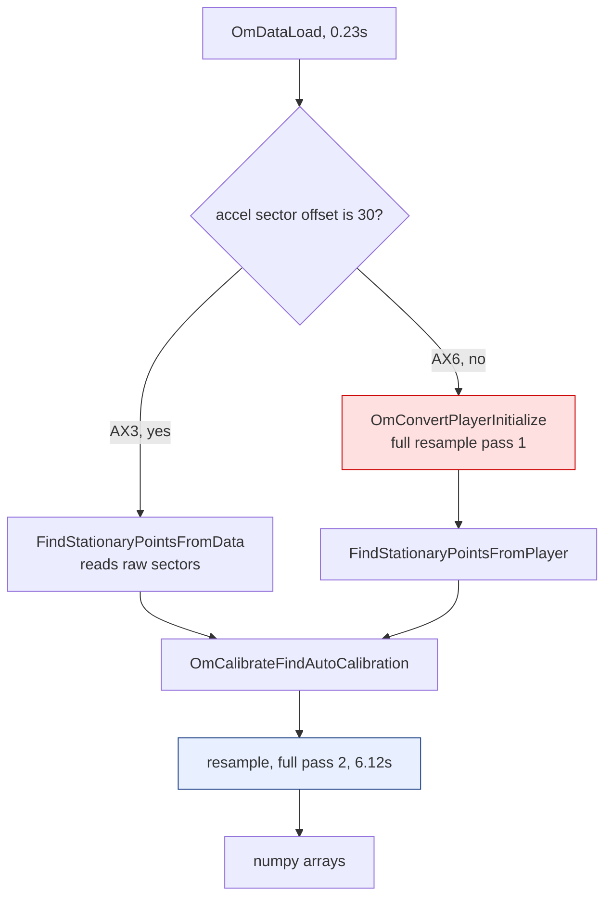
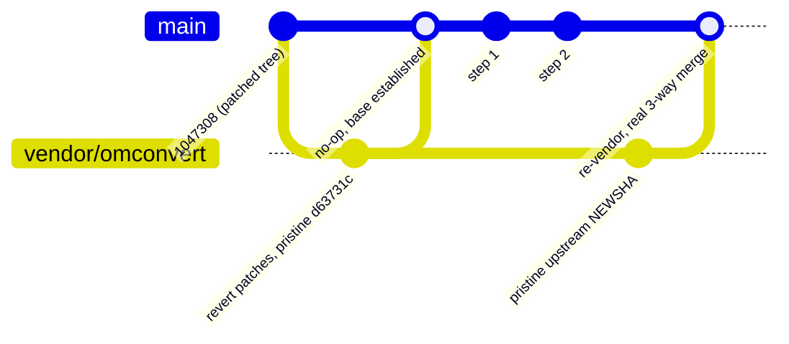
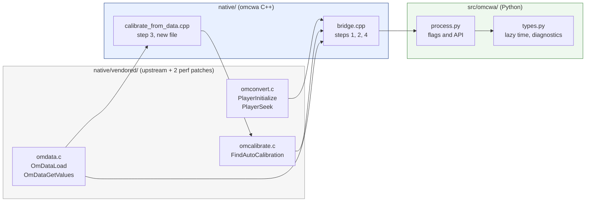
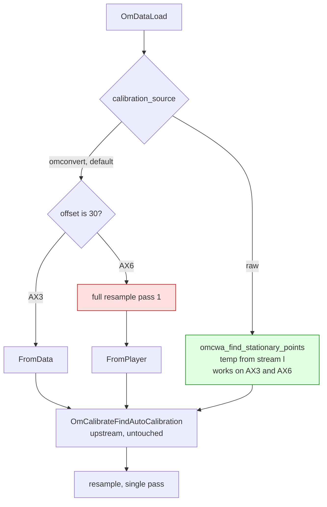
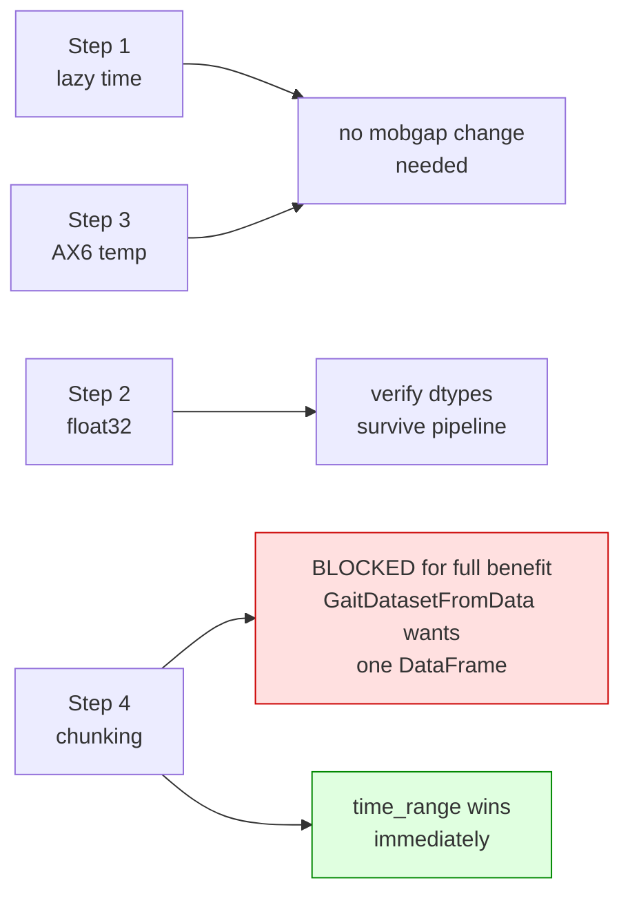

# omcwa performance plan

The plan covers two things. Part A replaces the `.patch` files under
`native/patches/` with a git based workflow. Part B implements four performance
changes, none of which need a new patch to the vendored C.

Everything here is grounded in measurements taken on this branch. Every number
has a command next to it that reproduces it.

---

## 1. Where the branch is right now

Branch `perf/native-hotpath-fixes`, tip `1047308` (merge of `main`).
Working tree is clean apart from untracked `.cache/` and `.claude/`.

### Already landed

Two patches to the vendored C, both applied and committed in
`native/vendored/omconvert/`, both proven to leave output byte identical:


| patch                               | what it does                                                | measured on a 931.5 MB AX6 file                    |
| ----------------------------------- | ----------------------------------------------------------- | -------------------------------------------------- |
| `0001-omdata-replace-timegm`        | replaces libc `timegm()` with the days-from-civil algorithm | `OmDataLoad` 16.84s to 0.23s                       |
| `0002-interpolator-neighbour-cache` | 4-row sliding cache in `interpolator_t`                     | 905M decode calls to 155M, resample 7.91s to 6.12s |


Also on the branch: the GIL is released around both native loops
(`native/bridge.cpp`), `process_cwa` skips allocating the temperature array,
a benchmark suite in `benchmarks/`, and profiling scripts in `scripts/profiling/`.

### The reference file

Most numbers below come from a 931.5 MB AX6 recording, 209 hours at 100 Hz,
75,420,850 output samples. If you don't have it, `benchmarks/synthetic_cwa.py`
generates deterministic CWA files of any length at roughly 350 MB/s.

```bash
export CWA=/path/to/large.cwa
```


### Current output cost per sample


| array                    | bytes | at 75.4M samples |
| ------------------------ | ----- | ---------------- |
| `time` float64           | 8     | 603 MB           |
| `acc` float64 (n,3)      | 24    | 1810 MB          |
| `gyr` float64 (n,3)      | 24    | 1810 MB          |
| `valid` + `clipped` bool | 2     | 151 MB           |
| total                    | 58    | 4374 MB          |


Plus roughly 931 MB of memory mapped file, which is clean and evictable.

---


## 2. What this session found

Read this section before touching code. It is the reasoning behind Part B.

### 2.1 AX6 pays for two full resample passes, and the cause is a temperature byte

`OmCalibrateFindStationaryPoints` in `native/vendored/omconvert/omcalibrate.c:243`
reads the temperature like this:

```c
if (dataSegment->description.offset == 30)
{
    const unsigned char *p = data->buffer + (OMDATA_SECTOR_SIZE * sectorIndex);
    int16_t inttemp = p[20] | ((int16_t)p[21] << 8);
    temp = ((int)inttemp * 150 - 20500) / 1000.0;
}
```

`offset == 30` is true for the AX3 sector layout and false for AX6. So
`native/bridge.cpp:390` (`prefer_calibrate_from_data`) sends AX6 down the
player path, which runs the interpolating resampler across the whole recording
just to attach a temperature to every sample. Then `resample()` runs it again to
produce the actual output.




The temperature AX6 needs already exists. `native/vendored/omconvert/omdata.c:731`
builds a virtual stream `'l'` holding battery, light and temperature, one sample
per sector, and it does this for both `'a'` and `'g'` sectors:

```c
if (format == 0 && (streamIndex == 'a' || streamIndex == 'g'))
{
    streamIndex = 'l';      // battery, light, temperature
    description.samplesPerSector = 1;
    ...
}
```

Temperature moves over minutes. Calibration averages it over 10 second windows.
Interpolating it to 100 Hz buys nothing.

Reproduce the cost split:

```bash
.venv/bin/python scripts/profiling/phase_profile.py "$CWA" --json phases.json
```

Compare the `calibrate` stage on an AX6 file against an AX3 file. I expect AX6
close to the resample figure and AX3 near zero. Confirm that before starting
step 3, because it sets the size of the prize.

### 2.2 The `time` array is fully derivable

`native/bridge.cpp:539`:

```cpp
const double t = arrangement.startTime + static_cast<double>(sample) / rate;
time_out[sample] = t;
```

A perfectly uniform grid, no gaps. omconvert marks missing data with
`valid[i] = false` and still writes the timestamp. So 603 MB describes two
scalars. `arrangement.startTime` already comes back to Python as
`result["start_time"]` at `native/bridge.cpp:594`, and `process.py` throws it away.

### 2.3 float32 is safe for `acc` and `gyr`, and it is faster

I ran the real mobgap algorithms on the real `LabExampleDataset` with float32
and float64 input.

Bit identical between the two: gait sequence boundaries, every initial contact
across all three detectors, stride start and end samples, `stride_duration_s`,
`cadence_spm`.

Two outputs move:


| column              | max absolute diff | max relative | typical value |
| ------------------- | ----------------- | ------------ | ------------- |
| `stride_length_m`   | 4.4e-08 m         | 1.18e-07     | 0.98 m        |
| `walking_speed_mps` | 3.7e-08 m/s       | 1.16e-07     | 0.75 m/s      |


float32 machine epsilon is 1.19e-07. The measured drift is 1.18e-07, so it is
one float32 ULP, the smallest difference the format can express. Nothing
accumulated. In physical terms the stride length shifts by 44 nanometres.

Both are the only continuous outputs derived by integrating acceleration, which
is exactly where accumulation would appear if there were any.

Why float32 and not float16: float16 represents integers exactly only up to
2048, and the raw samples are int16 running to 32767. It cannot hold the input.
Its step at full scale accel is 0.0156 g against a sensor LSB of 0.00049 g,
32 times coarser than the measurement. It also fails the existing parity
tolerance in `tests/test_process_parity.py` by a factor of 64.

Why `time` stays float64: at 1.7e9 unix seconds the float32 step is 128 seconds.

Memory and speed, `GsdIonescu` on synthetic recordings, peak RSS:


| recording | f64 array | f64 peak | f32 array | f32 peak | saved   | GSD time       |
| --------- | --------- | -------- | --------- | -------- | ------- | -------------- |
| 60 h      | 1.04 GB   | 2.36 GB  | 0.52 GB   | 1.56 GB  | 0.80 GB | 1.77s to 1.56s |
| 100 h     | 1.73 GB   | 3.69 GB  | 0.86 GB   | 2.42 GB  | 1.27 GB | 3.10s to 2.59s |


The saving beats the array saving because the working copies inside the pipeline
shrink too. float32 was faster in every run, by 12 to 27 percent.

A 200 hour run gave nonsense on my machine, float32 peak reading above float64.
That is memory pressure and macOS compressing anonymous pages, the failure mode
`scripts/profiling/README.md` already warns about. Ignore any RSS number taken
under pressure.

Reproduce, from the mobgap-plus checkout:

```bash
.venv/bin/python -c "
import numpy as np, warnings; warnings.filterwarnings('ignore')
from mobgap.data import LabExampleDataset
from mobgap.pipeline import MobilisedPipelineHealthy
ds = LabExampleDataset(reference_system='INDIP')
dp = ds.get_subset(cohort='HA', participant_id='001', test='Test11', trial='Trial1')
class Cast:
    def __init__(s, d, t): s._d, s._t = d, t
    def __getattr__(s, k):
        v = getattr(s._d, k)
        return v.astype(s._t) if k == 'data_ss' else v
a = MobilisedPipelineHealthy().run(Cast(dp, np.float64)).per_stride_parameters_
b = MobilisedPipelineHealthy().run(Cast(dp, np.float32)).per_stride_parameters_
na, nb = a.select_dtypes('number'), b.select_dtypes('number')
d = (na - nb).abs()
print('max abs', np.nanmax(d.to_numpy()))
print('max rel', np.nanmax((d / na.abs().replace(0, np.nan)).to_numpy()))
"
```


### 2.4 Where mobgap promotes float32 back to float64


| stage                     | float32 in, out |
| ------------------------- | --------------- |
| `Resample`                | float32         |
| `SavgolFilter`            | float32         |
| `GaussianFilter`          | float32         |
| `CwtFilter`               | float32         |
| `EpflDedriftedGaitFilter` | float64         |


`filtfilt` and `sosfiltfilt` promote because `scipy.signal.butter` returns
float64 coefficients. The numba function at
`mobgap/gait_sequences/_gsd_iluz.py:420` does the same for a different reason,
its signature says `float64[:]` so numba makes a silent float64 copy.

Neither matters much. Both run after `Resample(40)` and both work on the
one dimensional acceleration norm, not the six column frame. For 209 hours that
is roughly 240 MB of temporary float64 against 3.6 GB of sample arrays.

pandas behaves. A DataFrame built on a float32 array stays float32 through
`to_numpy()` and arithmetic, and does not copy on construction.

### 2.5 mobgap-plus multiplies the data four times

I have not profiled this, so treat it as reasoning to check. Reading
`mobgap/data/uos/openmovement_cwa.py`, one 209 hour recording goes through:

1. `out.acc` and `out.gyr` arrive, 3.6 GB
2. `_drop_invalid_samples` masks both, so two full sets live at once, 7.2 GB
3. `_recording_to_dataframe` runs `out.acc[:, 0] * GRAV_MS2` six times, each
  allocating a fresh column, another 3.6 GB
4. pandas consolidates six float64 columns into one block, copying again

That would explain the 8 to 10 GB peak better than anything omcwa does.

### 2.6 Two small bugs in mobgap-plus, worth fixing regardless

`openmovement_cwa.py:89` calls `out.time.astype(np.float64)`. The array is
already float64 and `.astype` copies by default, so that line silently doubles
the time array.

`aggregation/uos/_time_bins.py:179` infers the sampling rate from two samples:

```python
sampling_interval_s = sample_times[1] - sample_times[0]
```

After `drop_invalid=True`, one invalid sample sitting between the first two kept
samples doubles that interval and the rate for the whole timeline comes out
wrong by 2x. The true rate is in `out.sample_rate_hz`. Pass it explicitly.

### 2.7 Calibration failure codes mean different things

From `omcalibrate.c:632-672`:


| code | meaning                                     | what a user should do              |
| ---- | ------------------------------------------- | ---------------------------------- |
| -1   | fewer than 4 stationary points              | participant barely stopped moving  |
| -2   | no axis covers the +/-0.3 g range           | stopped, but always in one posture |
| -3   | one axis covers it                          | same, slightly better              |
| -4   | two axes cover it                           | same, nearly enough                |
| -5   | fit exceeded the max scale or offset limits | suspect data or a broken device    |


Today `CalibrationError` carries only the integer. -1 and -2 need opposite
remedies. Until callers can tell them apart, choosing a replacement calibration
algorithm is guesswork.

---


## 3. Part A: replace the patch files with a vendor branch


### Why the current setup annoys you, and what is actually wrong with it

The patched C is committed and readable. `native/vendored/omconvert/omdata.c`
on this branch is upstream plus our changes, on disk, greppable, debuggable. The
`.patch` files are a replay script for the next re-vendor, not storage.

The real problem is different. When `scripts/vendor_omconvert.sh` overwrites the
tree and a patch no longer applies, `git apply` fails with a hunk offset and you
resolve it by hand outside git. There is no merge base, no conflict markers, no
history. That is the part worth fixing.

### The design

Keep a branch `vendor/omconvert` whose tree holds pristine upstream in the same
paths. Merge from it. Git then does a real three way merge on re-vendor, with
real conflict markers in the real files.




Two things you get that patches cannot give you:

`git diff vendor/omconvert -- native/vendored/omconvert/` prints your exact
delta against upstream, at any commit, forever. It cannot go stale because
nothing has to be kept in sync.

Re-vendoring becomes `git merge`. Conflicts arrive as markers in the C file, and
you resolve them with the same tools you use for everything else.

### Bootstrap, run once

I checked this against the tree on 2026-08-20. `git apply --check -R native/patches/*.patch` succeeds, and the two patches account for exactly the
vendored delta against `main`, 26/1 lines in `omdata.c`, 40/3 in `omconvert.c`,
9/0 in `omconvert.h`. So the revert below produces pristine upstream with
nothing left over.

```bash
git switch -c vendor/omconvert
git apply -R native/patches/*.patch          # back to pristine upstream
git rm -r native/patches
git commit -am "vendor: pristine omconvert @ d63731c"
git switch perf/native-hotpath-fixes
git merge vendor/omconvert                   # establishes the merge base
```

The merge will conflict on the three patched files. Resolve by keeping the
working branch version, which is the patched one. After that:

```bash
git diff vendor/omconvert -- native/vendored/omconvert/ | diffstat
```

should show exactly the two performance patches.

### Changes to `scripts/vendor_omconvert.sh`

Delete the patch replay block at the end, the loop over
`"${patch_dir}"/*.patch`. The script becomes a pure "copy upstream in" tool that
you only ever run while sitting on `vendor/omconvert`. Add a guard at the top:

```bash
current_branch="$(git -C "${root_dir}" rev-parse --abbrev-ref HEAD)"
if [[ "${current_branch}" != "vendor/omconvert" ]]; then
    echo "ERROR: run this on the vendor/omconvert branch only." >&2
    echo "  git switch vendor/omconvert && ./scripts/vendor_omconvert.sh" >&2
    echo "Then merge it into your working branch: git merge vendor/omconvert" >&2
    exit 1
fi
```


### New file `scripts/vendor_diff.sh`

```bash
#!/usr/bin/env bash
# Print every local change to the vendored omconvert tree.
set -euo pipefail
root_dir="$(cd "$(dirname "${BASH_SOURCE[0]}")/.." && pwd)"

if ! git -C "${root_dir}" rev-parse --verify --quiet vendor/omconvert >/dev/null; then
    echo "ERROR: branch vendor/omconvert is missing." >&2
    echo "See docs/performance-plan.md, section 3, for the bootstrap." >&2
    exit 1
fi

echo "Local changes to native/vendored/omconvert vs upstream"
echo "upstream pin: $(git -C "${root_dir}" show vendor/omconvert:native/vendored/omconvert/OMCONVERT_VERSION | tr '\n' ' ')"
echo
git -C "${root_dir}" diff --stat vendor/omconvert -- native/vendored/omconvert/
echo
git -C "${root_dir}" diff "$@" vendor/omconvert -- native/vendored/omconvert/
```

Make it executable. `./scripts/vendor_diff.sh` shows everything,
`./scripts/vendor_diff.sh --stat` just the summary.

### New file `native/VENDORING.md`

Move the rationale from `native/patches/README.md` there, because the
explanation of why `timegm()` was replaced and what the neighbour cache does is
worth keeping. Drop the "re-applying" section and replace it with the merge
workflow. Delete `native/patches/` in the same commit.

### CI

Add a job that runs on any PR touching `native/vendored/` and posts
`./scripts/vendor_diff.sh --stat` into the build log. Reviewers then see the
delta growing without having to look for it. Do not gate on it, just make it
visible.

### The tier rule, which matters more than the tooling


| tier | what                                    | where it lives             | flag                      |
| ---- | --------------------------------------- | -------------------------- | ------------------------- |
| A    | performance only, byte identical output | `native/vendored/`         | none, always on           |
| B    | changes numbers                         | `native/` outside vendored | runtime flag, default off |
| C    | new algorithms                          | `native/` or `src/omcwa/`  | runtime flag              |


Nothing in Part B needs a tier A or tier B patch. If you find yourself editing
`native/vendored/` while implementing steps 1 to 4, stop and re-read section 4.3,
because the C API almost certainly already gives you the seam.

The point of the rule is that the parity story stays one sentence: the vendored
tree is upstream `d63731c` plus two performance patches with proven identical
output, and everything else is our own code on omconvert's public API.

---


## 4. Part B: the four steps




Do them in order. Step 1 is a prerequisite for step 4, and step 3 is the biggest
time win so it should not wait behind the harder work.

### 4.1 Step 1: lazy time, plus calibration diagnostics


#### Lazy time

`src/omcwa/types.py`:

```python
from functools import cached_property

@dataclass
class ProcessedRecording:
    sample_rate_hz: float
    start_time: float
    n_samples: int
    acc: npt.NDArray[np.float64]
    gyr: npt.NDArray[np.float64] | None
    calibration: Calibration
    metadata: dict[str, Any]
    valid: npt.NDArray[np.bool_]
    clipped: npt.NDArray[np.bool_]
    # set only when the timeline is not uniform, e.g. after dropping samples
    time_override: npt.NDArray[np.float64] | None = None

    @cached_property
    def time(self) -> npt.NDArray[np.float64]:
        """Unix seconds per sample. Built on first access."""
        if self.time_override is not None:
            return self.time_override
        return self.start_time + np.arange(self.n_samples, dtype=np.float64) / self.sample_rate_hz

    @property
    def first_sample_time(self) -> float:
        """Time of the first sample. Allocates nothing."""
        if self.time_override is not None:
            return float(self.time_override[0])
        return self.start_time
```

Use `cached_property`, not `property`. Today the array always exists so repeated
`out.time` is free. A plain property turns `for ...: out.time` into a 603 MB
allocation per iteration. `cached_property` allocates at most once and only if
touched, which is strictly better than today in every case.

`native/bridge.cpp`: add `with_time` to `resample()`, mirroring the existing
`with_temp` pattern at line 507. When false, skip `time_arr` entirely and return
`py::none()`.

`src/omcwa/process.py`: pass `with_time=False`, read `result["start_time"]` and
`result["sample_rate_hz"]`, set `n_samples` from `acc.shape[0]`.

`src/omcwa/slice.py`: `_time_mask` currently builds a full boolean mask over
`recording.time`, which would now materialise the array. Replace with index
arithmetic for the uniform case:

```python
first = 0 if start is None else max(0, ceil((start - rec.start_time) * rec.sample_rate_hz))
last  = rec.n_samples if stop is None else min(rec.n_samples, ceil((stop - rec.start_time) * rec.sample_rate_hz))
```

then slice with `[first:last]`, which gives views rather than copies. Keep the
mask path for the `time_override` case. This also removes a full length boolean
allocation from every `time_range=` call.

`UniformRecording` gets the same treatment. Do both or the two types drift.

#### Calibration diagnostics

`native/bridge.cpp` in `auto_calibrate()`, after
`OmCalibrateFindAutoCalibration` returns, the stationary points are still alive
and `OmCalibrateMeanSvmError` is public in `omcalibrate.h:111`. Compute and
return:

- `num_stationary_points` from `stationary_points->numValues`
- `axis_min[3]` and `axis_max[3]` by walking `stationary_points->values[i].mean[c]`
- `mean_svm_error` from `OmCalibrateMeanSvmError(&native, stationary_points)`
- `num_axes` from `native.numAxes`

Add them to `Calibration` in `src/omcwa/types.py` and include them in the
`CalibrationError` message. The axis coverage is what separates error -1 from
error -2, and that is the whole point.

Do not compute these inside `native/vendored/`. Walking the public
`omcalibrate_point_t` array in `bridge.cpp` is a dozen lines.

#### Verify

```bash
uv pip install -e . --no-deps
uv run pytest tests
.venv/bin/python scripts/profiling/verify_identical.py "$CWA" result.json
```

`verify_identical.py` hashes every output array. `acc`, `gyr`, `valid` and
`clipped` must not change. `time` will now be built on demand, so confirm
`out.time` still hashes the same as the baseline from `main`.

Expected win: 603 MB off peak, and `time_range=` stops allocating a full length
boolean mask.

### 4.2 Step 2: float32 output

`native/bridge.cpp`: the sample loop writes through `double*` pointers already.
Template the loop on the output type, or write two loops and pick with a flag.
Keep `time` float64 unconditionally, and keep every calibration computation in
double. `apply_accel_calibration` should stay double internally and narrow only
on the store.

`src/omcwa/process.py`: add `dtype: Literal["float64", "float32"] = "float64"`.
Ship as opt-in. Flip the default only after running real recordings end to end
through mobgap.

New test in `tests/`: assert that float32 output equals float64 output within
one float32 ULP, on the golden fixtures. That is the property you actually rely
on, and it will catch a future change that breaks it.

Expected win: 1.8 GB off peak at 209 hours, plus 12 to 27 percent off mobgap's
GSD time.

### 4.3 Step 3: AX6 calibration reads temperature from stream 'l'

This is the largest time win and the only step that moves any numbers.

Do not patch `omcalibrate.c`. The seam already exists, because
`omcalibrate.h:58-81` makes the stationary point struct public and separates
finding the points from fitting the calibration:

```c
typedef struct {
    omcalibrate_point_t *values;
    int numValues;
    int capacity;
} omcalibrate_stationary_points_t;

int OmCalibrateFindAutoCalibration(omcalibrate_config_t *config,
                                   omcalibrate_stationary_points_t *stationaryPoints,
                                   omcalibrate_calibration_t *calibration);
```

`OmDataGetValues` and `OmDataTimestampForSector` are public too, in
`omdata.h:243` and `omdata.h:246`.

New file `native/calibrate_from_data.cpp`:

```cpp
// omcwa code, not vendored. Mirrors the data path of
// OmCalibrateFindStationaryPoints but reads temperature from the 'l'
// side-channel stream, which exists on AX6 as well as AX3.
// ref: native/vendored/omconvert/omdata.c:731
omcalibrate_stationary_points_t* omcwa_find_stationary_points(
        const omcalibrate_config_t& cfg, omdata_t* data);
```

It walks the `'a'` stream segments with `OmDataGetValues`, accumulates mean and
standard deviation over `cfg.stationaryTime` second windows, pulls the
temperature for each window from stream `'l'` by sector index, and emits a point
when every axis standard deviation falls below `cfg.stationaryMaxDeviation`.
Port the window logic from `omcalibrate.c:51-260` rather than inventing it,
including the "ignore repeated measurements" handling, or AX3 and AX6 results
will differ for reasons unrelated to temperature.

Then in `bridge.cpp`:

```cpp
auto* points = omcwa_find_stationary_points(config, &data_);
int rc = OmCalibrateFindAutoCalibration(&config, points, &native);  // upstream, untouched
```

`native/CMakeLists.txt`: change `pybind11_add_module(_native bridge.cpp)` to
include `calibrate_from_data.cpp`.

`src/omcwa/process.py`: add
`calibration_source: Literal["omconvert", "raw"] = "omconvert"`. Default keeps
today's behaviour exactly. `"raw"` uses the new finder for every device.

Make this a runtime flag, not a build option. One binary with both paths lets a
single test run both in the same process and compare them directly, which is
the parity test you actually want. It also lets a researcher who gets a strange
AX6 result flip one keyword instead of rebuilding.




#### Verify

AX3 output must be byte identical under both settings, because the AX3 path
never used the player. That is the strongest single check and it is cheap:

```bash
.venv/bin/python scripts/profiling/verify_identical.py "$AX3_CWA" ax3_omconvert.json
# then with calibration_source="raw"
diff <(jq 'del(.wall_seconds,.peak_footprint)' ax3_omconvert.json) \
     <(jq 'del(.wall_seconds,.peak_footprint)' ax3_raw.json)
```

For AX6 the coefficients will move. Report the difference in calibration scale
and offset per axis, and the change in `mean_svm_error` from step 1's
diagnostics. If the new path finds more stationary points and a lower residual
error, it is better, not just different. Write that comparison down somewhere
durable, because it is the argument you will have to make to a reviewer.

Expected win: one full resample pass on AX6, roughly half the wall time.
Confirm the size with `phase_profile.py` first.

### 4.4 Step 4: chunked reading

Today memory grows with recording length. Ten concurrent 1 GB uploads need
roughly 50 GB, which is why the server plan does not work.

`scripts/profiling/bench_stream.c` on this branch already proved the time cost
is flat across chunk sizes while the output buffer falls from 4.2 GB to under
1 MB:

```bash
./scripts/profiling/build_native_benches.sh
for c in 0 1000000 100000 10000; do ./build-bench/bench_stream "$CWA" $c 2>/dev/null; done
```

`native/bridge.cpp`: add a method that fills caller supplied buffers for a
sample range rather than allocating full length arrays.
`OmConvertPlayerInitialize` and `OmConvertPlayerSeek` are public
(`omconvert.h:177-178`) and `bridge.cpp` already calls both, so this is a
different loop over the same C, not new C.

`src/omcwa/process.py`: add a generator.

```python
def iter_cwa(path, *, chunk_samples=1_000_000, **kw) -> Iterator[ProcessedRecording]:
    """Yield the recording in chunks. Memory is O(chunk_samples)."""
```

Each chunk is a `ProcessedRecording` with its own `start_time` and `n_samples`,
so `time` stays derivable per chunk. That is why step 1 comes first.

Apply `time_range` at seek time instead of after the fact. Right now
`process_cwa` resamples the whole file and then trims, which
`scripts/profiling/extra_checks.py` already demonstrates:

```bash
.venv/bin/python scripts/profiling/extra_checks.py "$CWA"
```

Fixing that is the piece of step 4 that helps mobgap without mobgap changing
anything, because `load_cwa_as_dataset` already forwards `time_range`.

`process_cwa` keeps working unchanged. Implement it as a thin wrapper that
concatenates chunks, or leave it on the existing path. Do not break it.

---


## 5. Blockers and what mobgap-plus has to do




### The real blocker: chunking has nowhere to go

`GaitDatasetFromData` takes one DataFrame covering the whole recording. So
streaming inside omcwa does not reduce mobgap's peak memory. Someone has to
teach mobgap to consume chunks, and that is genuine work in
`mobgap/data/_dataset_from_data.py` plus every algorithm that assumes it can
index the full recording.

`GsdIonescu` already resamples to 40 Hz internally and works on the acceleration
norm, so gait sequence detection is a plausible first chunked consumer. The
per bout algorithms already operate on slices. I would not promise a date on
this without looking harder at `GaitDatasetFromData`.

What you get without touching mobgap is `time_range`, because
`load_cwa_as_dataset` already forwards it.

### Changes mobgap-plus needs, in the order I would do them

Fix `.astype(np.float64)` at `openmovement_cwa.py:89`. One keyword, `copy=False`,
or delete the call. It doubles the time array today for no reason.

Guard `_drop_invalid_samples` so it only builds the masked timeline when
`include_time_index=True`. Right now it builds it on every call and the default
never reads it.

Hand pandas one 2D array instead of six columns in `_recording_to_dataframe`.
Build an `(n, 6)` array once, scale the accelerometer part in place, pass it to
the DataFrame constructor with the column names. This removes both the six per
column allocations and the consolidation copy, and I think it is the single
biggest memory win available anywhere in either repo. Measure it first.

Update the four `out.time` call sites once omcwa ships `start_time` and
`n_samples`:


| line                      | today                                   | after                                                                                   |
| ------------------------- | --------------------------------------- | --------------------------------------------------------------------------------------- |
| `openmovement_cwa.py:247` | `len(out.time) == 0`                    | `out.n_samples == 0`                                                                    |
| `openmovement_cwa.py:261` | `float(out.time[0])`                    | `out.first_sample_time`                                                                 |
| `openmovement_cwa.py:52`  | `out.time[mask]`                        | `out.start_time + np.flatnonzero(mask) / out.sample_rate_hz`, passed as `time_override` |
| `openmovement_cwa.py:89`  | `pd.Index(out.time.astype(np.float64))` | `pd.Index(out.time)`                                                                    |


The third one is the important one. It gives byte identical values, because
`out.time[i]` is exactly `start + i/rate` and `flatnonzero` picks exactly the
retained values of `i`. Gap information survives, which matters because
`bin_coverage` at `_time_bins.py:360` counts real samples per hour bin. Lose the
gaps and an hour where the device sat dead reports coverage 1.0 instead of 0.0.

Pass the true sampling rate into `RecordingTimeline.from_sample_times` instead
of inferring it from two samples.

### Coordination

`out.time` keeps working through all of this, so omcwa can ship first and
mobgap-plus can pick up the call site changes whenever. They do not have to land
together. `n_samples`, `start_time` and `first_sample_time` are new, so
mobgap-plus needs an omcwa version bump before using them.

### One thing to warn people about

Anyone comparing new output against archived float64 results will see
`stride_length_m` differ in the eighth decimal place. Harmless numerically, and
it will still look alarming in a diff. Tell whoever maintains reference results
before flipping the float32 default.

### Things I did not verify

The float32 correctness testing used `LabExampleDataset`, roughly two minutes
per trial. The arithmetic says length should not matter, since the drift is one
ULP rather than accumulation, but nobody has run float32 on a 200 hour real
recording end to end.

I have not profiled `load_cwa_as_dataset` itself. Section 2.5 is reasoning from
reading the code, not measurement. Point `benchmarks/memory.py` at it before
committing to the four copy theory.

The size of the step 3 prize depends on the calibrate stage timing, which I did
not measure separately on an AX6 file. Run `phase_profile.py` first.

---


## 6. Order of work


| #   | task                                                                    | touches                                                   | risk   | prerequisite |
| --- | ----------------------------------------------------------------------- | --------------------------------------------------------- | ------ | ------------ |
| 1   | vendor branch bootstrap, `vendor_diff.sh`, delete `native/patches/`     | scripts, git                                              | low    | none         |
| 2   | calibration diagnostics                                                 | `bridge.cpp`, `types.py`                                  | low    | none         |
| 3   | lazy `time`, index based `slice.py`                                     | `bridge.cpp`, `types.py`, `process.py`, `slice.py`        | low    | none         |
| 4   | float32 option plus ULP test                                            | `bridge.cpp`, `process.py`, `tests/`                      | low    | 3            |
| 5   | mobgap-plus: `.astype` fix, guard `_drop_invalid_samples`, 2D DataFrame | mobgap-plus                                               | low    | none         |
| 6   | AX6 temperature path                                                    | `calibrate_from_data.cpp`, `CMakeLists.txt`, `process.py` | medium | 2            |
| 7   | chunked reader plus `time_range` at seek                                | `bridge.cpp`, `process.py`                                | medium | 3            |
| 8   | mobgap-plus chunk consumption                                           | mobgap-plus                                               | high   | 7            |


Items 1 through 5 are engineering with automated proof. None of them require
defending a scientific position. Item 6 does, which is why it has the diagnostics
from item 2 as a prerequisite. Item 8 is the one I would scope properly before
promising anything.

## 7. Standing checks

After every step:

```bash
uv pip install -e . --no-deps
uv run pytest tests
uv run pytest benchmarks
./scripts/vendor_diff.sh --stat        # should still show only the two perf patches
```

And on a real file:

```bash
.venv/bin/python scripts/profiling/verify_identical.py "$CWA" result.json
diff <(jq 'del(.wall_seconds,.peak_footprint)' baseline.json) \
     <(jq 'del(.wall_seconds,.peak_footprint)' result.json)
```

`baseline.json` comes from `main`. Steps 1, 3 and 4 must not change a single
hash. Step 2 changes them by design, and that is what the ULP test is for.